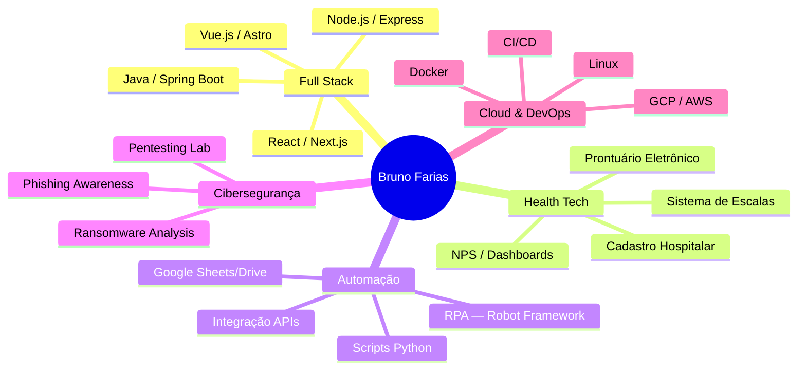

<div align="center">

[](https://git.io/typing-svg)


[](https://www.linkedin.com/in/bruno-souza-farias)
[](https://brunosouzafarias.github.io)
[](https://github.com/BrunoSouzaFarias)

</div>

---

## 🧑‍💻 Sobre mim

```yaml
nome: Bruno de Souza Farias
cargo: Supervisor de Operações N1
empresa: Liberty TI — Health Tech
localização: São Paulo, SP
formação: Cibersegurança
```

> Supervisor de TI e desenvolvedor full stack, unindo gestão de operações e engenharia de software para resolver problemas reais de **Health Tech**. Lidero equipe e processos de suporte N1 na Liberty TI e, em paralelo, construo sistemas que vão de **prontuários eletrônicos** a **RPAs** que eliminam trabalho manual repetitivo, sempre com foco em automação, dados e impacto operacional mensurável.

### 🎯 Foco Atual
- 🏥 Prontuário Eletrônico (EHR) — arquitetura e desenvolvimento
- 📊 Sistemas de escalas inteligentes com validações automáticas
- 🤖 Automação de processos hospitalares com RPA
- 📈 Dashboards e indicadores (NPS, SLA) para acompanhamento operacional
- 📚 Estudando **Java avançado**, **Arquitetura de Sistemas** e **Inglês técnico**

---

## 🛠️ Tech Stack

### Linguagens
<p>
  
</p>

### Frontend
<p>
  
</p>

### Backend & APIs
<p>
  
</p>

### Banco de Dados
<p>
  
</p>

### DevOps & Cloud
<p>
  
</p>

### Ferramentas & Outros
<p>
  
</p>

---

## 🚀 Projetos em Destaque

<div align="center">

| Projeto | Descrição | Tecnologias |
|---------|-----------|-------------|
| [**📁 Portfolio**](https://github.com/BrunoSouzaFarias/portfolio) | Portfólio profissional moderno, responsivo e focado em performance | `TypeScript` `React` `Next.js` `Docker` |
| [**💬 Feed-Track**](https://github.com/BrunoSouzaFarias/Feed-track) | Sistema de feedback com colaboradores com **IA integrada** para avaliação | `TypeScript` `IA` |
| [**🤖 PixelCrew**](https://github.com/BrunoSouzaFarias/PixelCrew) | Escritório virtual retrô em Pixel Art no VS Code para ver agentes de IA trabalhando em tempo real | `TypeScript` `WebSockets` |
| [**🏥 Login Cadastro Hospitalar**](https://github.com/BrunoSouzaFarias/login-cadastro) | Sistema de login para hospitais com API Python para automação no SGHX | `JavaScript` `Python` `API` |
| [**📊 Dashboard Py**](https://github.com/BrunoSouzaFarias/dashboardPy) | Dashboard para acompanhamento de chamados de CAPS | `Python` `Data Viz` |
| [**💈 Barbearia Canindé**](https://github.com/BrunoSouzaFarias/Barbearia-Caninde) | Site institucional one-page com lightbox, WhatsApp e design responsivo | `HTML5` `CSS3` `JavaScript` |
| [**🛒 Store Manager**](https://github.com/BrunoSouzaFarias/store-manager) | API RESTful de gerenciamento de vendas | `JavaScript` `Node.js` `Express` |
| [**☕ Cloud Parking**](https://github.com/BrunoSouzaFarias/cloud-parking) | API de estacionamento na nuvem | `Java` `Spring Boot` |
| [**📱 Matches Simulator**](https://github.com/BrunoSouzaFarias/matches-simulator-app) | App Android nativo de simulação de partidas | `Kotlin` `Android` |
| [**🔐 Ransomware Lab**](https://github.com/BrunoSouzaFarias/cibersecurity-desafio-ransomware) | Laboratório de cibersegurança — ransomware em Python (educacional) | `Python` `Security` |

</div>

---

## 📊 GitHub Stats & Atividade

<div align="center">
  
  
</div>

<div align="center">
  
</div>

<!--
  Os dois cards acima usam meu próprio fork do github-readme-stats hospedado no Vercel
  (github-readme-stats-sigma-five). Ele só renderiza corretamente com a env var PAT_1
  (um GitHub Personal Access Token com escopo read:user) configurada no projeto Vercel,
  evitando depender da instância pública compartilhada, que sofre com limite de taxa.
-->

A animação abaixo (Snake) é gerada por uma GitHub Action no meu próprio repositório e mostra meu histórico de contribuições de forma visual, sem depender de serviços externos de terceiros.

## 🐍 Contribuições (Snake)

<div align="center">
  <picture>
    <source media="(prefers-color-scheme: dark)" srcset="https://raw.githubusercontent.com/BrunoSouzaFarias/BrunoSouzaFarias/output/github-snake-dark.svg" />
    <source media="(prefers-color-scheme: light)" srcset="https://raw.githubusercontent.com/BrunoSouzaFarias/BrunoSouzaFarias/output/github-snake.svg" />
    
  </picture>
</div>

---

## 🏆 Conquistas

<div align="center">


</div>

---

## 🗂️ Áreas de Experiência

<div align="center">



</div>

---

## 📬 Contato

<div align="center">

[](https://www.linkedin.com/in/bruno-souza-farias)
[](https://brunosouzafarias.github.io)
[](https://github.com/BrunoSouzaFarias)

</div>

---

<div align="center">
  
</div>
